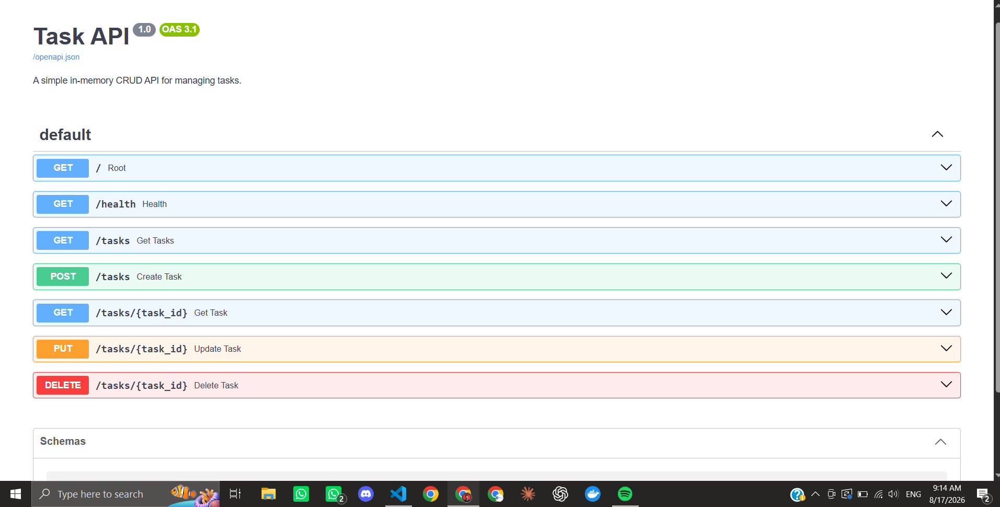

Replace your current `README.md` with this updated version. It removes the old **in-memory storage** wording and documents the finished SQLite-backed API, persistence, SQL work, and database screenshot required for Stage 5. 

````md
# Task API

A CRUD API built with Python, FastAPI, and SQLite as part of the FlyRank Backend AI Engineering Internship.

The project originally used an in-memory Python list for storage. It was later migrated to SQLite while keeping the same API endpoints, request formats, responses, validation rules, and HTTP status codes.

The main goal of this project is to demonstrate an important backend engineering concept:

> The API describes what the application does, while the database determines where the application stores its data.

---

## Features

- Create tasks
- List all tasks
- Get a task by ID
- Update a task's title and/or completion status
- Delete tasks
- SQLite database persistence
- Automatic database creation
- Automatic `tasks` table creation
- Three example tasks seeded only when the database is empty
- Parameterized SQL queries
- Custom `400` and `404` JSON error responses
- Correct HTTP status codes
- Health-check endpoint
- Interactive Swagger UI
- Data survives server restarts

---

## Tech Stack

- Python 3.10+
- FastAPI
- Uvicorn
- SQLite
- Python `sqlite3`
- Swagger UI / OpenAPI

---

## Architecture

The original version stored tasks in memory:

```text
Client
   ↓
FastAPI
   ↓
Python List
````

The current version stores tasks in SQLite:

```text
Client
   ↓
FastAPI
   ↓
SQL Queries
   ↓
SQLite
   ↓
tasks.db
```

The API endpoints did not change during the migration.

Only the storage layer changed.

This means clients using the API do not need to know whether the data is stored in memory, SQLite, PostgreSQL, or another database.

---

## Why SQLite?

SQLite was chosen because it is lightweight, simple to use, and requires no separate database server.

The entire database is stored in a single file:

```text
tasks.db
```

SQLite is suitable for this project because it:

* requires no separate database installation
* stores data persistently on disk
* supports standard SQL queries
* integrates directly with Python through the built-in `sqlite3` module
* makes it easy to understand relational database fundamentals

Unlike the original in-memory version, tasks stored in SQLite remain available after the FastAPI server is stopped and restarted.

---

## Database

The application automatically creates:

```text
tasks.db
```

when the server starts if the database file does not already exist.

It also automatically creates the `tasks` table if necessary.

The table contains:

| Column  | Type    | Description                                  |
| ------- | ------- | -------------------------------------------- |
| `id`    | INTEGER | Primary key used to uniquely identify a task |
| `title` | TEXT    | Task title                                   |
| `done`  | INTEGER | Completion status: `0` = false, `1` = true   |

The application inserts three example tasks only when the table is empty.

This prevents the seed data from being duplicated every time the application restarts.

---

## Project Structure

```text
flyrank-task-api/
│
├── docs/
│   ├── swagger-ui.png
│   ├── sqlite-database.png
│   └── BE-01_FastAPI_CRUD_Revision_Notes.md
│
├── .gitignore
├── main.py
├── requirements.txt
└── README.md
```

The local `tasks.db` file is excluded through `.gitignore`.

A fresh clone automatically creates its own database when the application starts.

---

## Run Locally

### 1. Clone the repository

```bash
git clone https://github.com/DevSaimX/flyrank-task-api.git
cd flyrank-task-api
```

### 2. Create a virtual environment

```bash
python -m venv .venu
```

On Windows PowerShell:

```powershell
.\.venu\Scripts\Activate.ps1
```

If PowerShell blocks activation, you can temporarily allow it for the current terminal session:

```powershell
Set-ExecutionPolicy -Scope Process -ExecutionPolicy RemoteSigned
```

Then activate the environment again:

```powershell
.\.venu\Scripts\Activate.ps1
```

### 3. Install dependencies

```bash
python -m pip install -r requirements.txt
```

SQLite does not need to be installed separately because Python includes the `sqlite3` module.

### 4. Start the API

```bash
python -m uvicorn main:app --reload
```

The API will be available at:

```text
http://localhost:8000
```

Interactive Swagger documentation:

```text
http://localhost:8000/docs
```

---

## API Endpoints

| Method | Endpoint           | Description                                | Success Status   |
| ------ | ------------------ | ------------------------------------------ | ---------------- |
| GET    | `/`                | Return basic API information               | `200 OK`         |
| GET    | `/health`          | Check whether the API is running           | `200 OK`         |
| GET    | `/tasks`           | Return all tasks from SQLite               | `200 OK`         |
| GET    | `/tasks/{task_id}` | Return one task by ID                      | `200 OK`         |
| POST   | `/tasks`           | Create a new task                          | `201 Created`    |
| PUT    | `/tasks/{task_id}` | Update task title and/or completion status | `200 OK`         |
| DELETE | `/tasks/{task_id}` | Delete a task                              | `204 No Content` |

---

## CRUD and SQL Mapping

| CRUD   | HTTP Method | SQL Operation |
| ------ | ----------- | ------------- |
| Create | POST        | `INSERT`      |
| Read   | GET         | `SELECT`      |
| Update | PUT         | `UPDATE`      |
| Delete | DELETE      | `DELETE`      |

All queries that contain dynamic values use parameterized placeholders instead of inserting user input directly into SQL strings.

Example:

```python
connection.execute(
    "SELECT * FROM tasks WHERE id = ?",
    (task_id,),
)
```

This keeps SQL instructions separate from user-provided values.

---

## Example Task

```json
{
  "id": 1,
  "title": "Learn FastAPI basics",
  "done": false
}
```

---

## Reading Tasks

Request:

```bash
curl -i http://localhost:8000/tasks
```

Example response:

```text
HTTP/1.1 200 OK
content-type: application/json

[
  {
    "id": 1,
    "title": "Learn FastAPI basics",
    "done": false
  },
  {
    "id": 2,
    "title": "Build CRUD API",
    "done": false
  },
  {
    "id": 3,
    "title": "Test API endpoints",
    "done": true
  }
]
```

The endpoint executes a SQL query equivalent to:

```sql
SELECT * FROM tasks;
```

---

## Creating a Task

Request body:

```json
{
  "title": "Buy milk"
}
```

The API executes an SQL `INSERT` operation:

```sql
INSERT INTO tasks (title, done)
VALUES (?, ?);
```

Example successful response:

```json
{
  "id": 4,
  "title": "Buy milk",
  "done": false
}
```

Status:

```text
201 Created
```

SQLite automatically generates the task ID.

---

## Updating a Task

Example request body:

```json
{
  "title": "Buy milk and eggs",
  "done": true
}
```

The database update uses SQL:

```sql
UPDATE tasks
SET title = ?, done = ?
WHERE id = ?;
```

The API also supports partial updates.

For example:

```json
{
  "done": true
}
```

updates only the completion status while preserving the existing title.

---

## Deleting a Task

Deleting a task uses SQL:

```sql
DELETE FROM tasks
WHERE id = ?;
```

Successful deletion returns:

```text
204 No Content
```

with an empty response body.

---

## Validation

Creating a task without a valid title returns:

```json
{
  "error": "Title is required and cannot be empty"
}
```

with:

```text
400 Bad Request
```

Requesting an unknown task returns a JSON error with:

```text
404 Not Found
```

Invalid update requests also return:

```text
400 Bad Request
```

The API preserves the same validation behavior that existed before the SQLite migration.

---

## Persistence

The original version stored tasks inside the running Python process.

That meant:

```text
Create task
   ↓
Stored in RAM
   ↓
Stop server
   ↓
Task disappears
```

The SQLite version stores tasks inside `tasks.db`:

```text
Create task
   ↓
INSERT into SQLite
   ↓
Saved in tasks.db
   ↓
Stop server
   ↓
Start server again
   ↓
Task still exists
```

Persistence was verified by:

1. Creating a new task through `POST /tasks`.
2. Confirming it appeared through `GET /tasks`.
3. Stopping the FastAPI server.
4. Starting the server again.
5. Confirming that the same task still existed.

This demonstrates that the database is now the application's persistent source of truth.

---

## SQL Queries Explored Manually

The database was opened using DB Browser for SQLite and several SQL queries were executed manually.

### List every task

```sql
SELECT * FROM tasks;
```

### Show only completed tasks

```sql
SELECT * FROM tasks WHERE done = 1;
```

This query returns only tasks whose completion value is stored as `1`.

### Count all tasks

```sql
SELECT COUNT(*) FROM tasks;
```

### Mark every task as completed

```sql
UPDATE tasks SET done = 1;
```

### Delete all completed tasks

```sql
DELETE FROM tasks WHERE done = 1;
```

Changes made directly through DB Browser were immediately visible through the FastAPI endpoints because both DB Browser and the API were accessing the same `tasks.db` file.

---

## SQLite Database Viewer

The database was inspected directly using DB Browser for SQLite.


The screenshot shows the `tasks` table and verifies that task data is stored inside SQLite rather than only in Python memory.

---

## Swagger UI

FastAPI automatically generates an OpenAPI specification and interactive Swagger documentation.

Open:

```text
http://localhost:8000/docs
```

The complete CRUD API can be tested through Swagger's **Try it out** feature.



---

## HTTP Status Codes

| Status            | Meaning                       |
| ----------------- | ----------------------------- |
| `200 OK`          | Successful read or update     |
| `201 Created`     | Task successfully created     |
| `204 No Content`  | Task successfully deleted     |
| `400 Bad Request` | Invalid request body          |
| `404 Not Found`   | Requested task does not exist |

---

## What Changed from Assignment 1?

The API contract stayed the same.

The following endpoints remained unchanged:

```text
GET    /tasks
GET    /tasks/{task_id}
POST   /tasks
PUT    /tasks/{task_id}
DELETE /tasks/{task_id}
```

The major implementation change was:

```text
Before:
FastAPI → Python list

After:
FastAPI → SQL → SQLite → tasks.db
```

Because the endpoints and responses remain the same, the storage layer can be changed without requiring clients to change how they use the API.

This separation between the API layer and data layer is one of the foundations of backend engineering.

---

## Author

Saim Iftikhar

Built for the FlyRank Backend AI Engineering Internship.

````

### One thing before committing

Make sure your screenshot is actually saved as:

```text
docs/sqlite-database.png
````

because the README references:

```md

```

